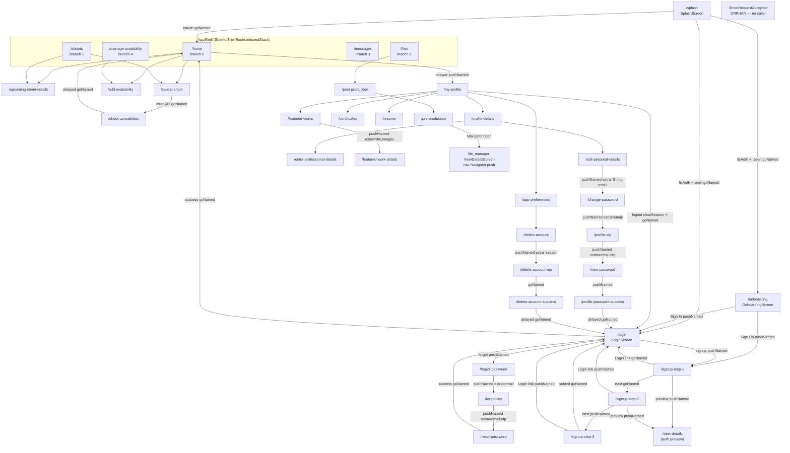

# Navigation Map — beige_creative_app

Snapshot of every screen, every route, and the wiring between them. Generated
from a full sweep of `lib/` on 2026-06-01 (branch `improvments-phase1`,
post-Phase 1-5 feature/Riverpod migration). Supersedes the pre-restructure
snapshot referenced by older docs.

> **Phase D delta (commit pending):** route count 37 → 38 (added
> `Routes.fileViewer` for `/file-viewer`). `lib/features/file_manager/presentation/screens/view_details_screen.dart`
> renamed to `file_viewer_screen.dart` (class `FileManagerViewDetailsScreen` →
> `FileViewerScreen`) to disambiguate from `auth/.../view_details_screen.dart` (P12).
> `lib/features/shoots/presentation/screens/shoot_request_accepted_screen.dart`
> deleted (P22 orphan). `lib/app/route_names.dart` deleted (post-Phase A shim).
> `AppShell` bottom bar hides on branch 4 instead of clamping to Dashboard (P9).
> Zero raw `Navigator.push` / `MaterialPageRoute` in `lib/` — `pre_production:223`
> moved to `pushNamed(Routes.fileViewer)`, `common_file_viewer:23` switched to
> `showDialog` (modal, not a routed screen). CI guard at
> `tool/check_no_navigator_push.sh`.

## 1. Source files

| Concern | File |
|---|---|
| App root + `ProviderScope` mount | `lib/app/app.dart` |
| Entrypoints | `lib/main_dev.dart`, `lib/main_prod.dart`, `lib/startup.dart` |
| Router config (root `GoRouter`) | `lib/app/router.dart` |
| Route-name constants (legacy shim) | `lib/app/route_names.dart` (to be replaced by `lib/app/routes.dart` in Phase A) |
| Auth state provider | `lib/core/providers/auth_state_provider.dart` |
| Onboarding-seen provider | `lib/core/providers/onboarding_seen_provider.dart` |
| Session persistence | `lib/core/session/session_store.dart` (Riverpod-wired via `sessionStoreProvider`) |
| Shell (5-tab bottom nav) | `lib/shared/layouts/app_shell.dart` |
| Analytics observer | `lib/core/firebase/app_analytics_observer.dart` |
| Per-feature route fragments | `lib/features/auth/presentation/routes/auth_routes.dart`, `lib/features/profile/presentation/routes/profile_routes.dart`, `lib/features/shoots/presentation/routes/shoots_routes.dart`, `lib/features/availability/presentation/routes/availability_routes.dart`, `lib/features/file_manager/presentation/routes/file_manager_routes.dart` |

## 2. State management

`flutter_riverpod` is wired. `startApp(env)` (in `lib/startup.dart`) initialises
`Env`, Firebase, `PrefsService`, `SessionStore`, then mounts `ProviderScope`
with overrides:

- `authStateProvider` (`StateProvider<bool>`) — seeded from `PrefsService.isLoggedIn`.
- `onboardingSeenProvider` (`StateProvider<bool>`) — seeded from `PrefsService.onboardingSeen`.
- `sessionStoreProvider` — concrete `PrefsSessionStore` over `SharedPreferences`.

Router lives in `routerProvider` (`Provider<GoRouter>`) — built once per
`ProviderScope`. A `_AuthRefreshNotifier` (router.dart:77-92) bridges
`authStateProvider` → `ChangeNotifier` so the router re-runs `redirect:` on
auth flips. `onboardingSeenProvider` is read inside `redirect:` but is NOT
listened on `refreshListenable` — flips of onboarding-seen do not retrigger
redirect (see §8 P4).

Feature state lives in per-feature notifiers under
`lib/features/<f>/presentation/providers/*.dart` (Phase 4 pattern). No Bloc /
plain `Provider` (package:provider) in the live tree.

## 3. Route inventory

37 declared `GoRoute`s. Every route has a non-empty `name` (verified by sweep).
`state.extra` shape column documents what the builder unpacks — `Map<String,dynamic>` everywhere except `/change-password` (bare `String`).

### 3.1 Entry routes (router.dart inline)

| # | Path | Name constant | Widget | Extra shape |
|---|---|---|---|---|
| 1 | `/splash` | `splash` | `SplashScreen` | — |
| 2 | `/onboarding` | `onboarding` | `OnboardingScreen` | — |

### 3.2 Shell branches (`StatefulShellRoute.indexedStack`, router.dart:109-159)

| # | Branch | Path | Name | Widget |
|---|---|---|---|---|
| 3 | 0 | `/home` | `home` | `HomeScreen` |
| 4 | 1 | `/shoots` | `shoots` | `ShootsScreen` |
| 5 | 2 | `/files` | `files` | `FileManagerScreen` |
| 6 | 3 | `/messages` | `messages` | `MessagesScreen` |
| 7 | 4 | `/manage-availability` | `manage-availability` | `ManageAvailabilityScreen` |

### 3.3 `authRoutes` (`auth_routes.dart`)

| # | Path | Name | Widget | Extra shape |
|---|---|---|---|---|
| 8 | `/login` | `login` | `LoginScreen` | — |
| 9 | `/signup-step-1` | `signup-step-1` | `SignUp1Screen` | — |
| 10 | `/signup-step-2` | `signup-step-2` | `SignUp2Screen` | Map: `crewMemberId, profileImage, email, firstName, lastName, location, workingDistance, step1Progress` (nullable cast `as Map<String,dynamic>? ?? {}`) |
| 11 | `/signup-step-3` | `signup-step-3` | `SignUp3Screen` | Map: + `primaryRole, experience, hourlyRate, bio, skills, equipments, step2Progress` (14 keys total) |
| 12 | `/forgot-password` | `forgot-password` | `ForgotPasswordScreen` | — |
| 13 | `/forgot-otp` | `forgot-otp` | `ForgotPasswordOtpScreen` | Map: `email` |
| 14 | `/reset-password` | `reset-password` | `ResetPasswordScreen` | Map: `email, otp` |
| 15 | `/view-details` | `view-details` | `ViewDetailsScreen` (auth/) | Map: 13 keys incl. `featuredImages: List<File>` |

### 3.4 `profileRoutes` (`profile_routes.dart`)

| # | Path | Name | Widget | Extra shape |
|---|---|---|---|---|
| 16 | `/my-profile` | `my-profile` | `Myprofile` | — |
| 17 | `/edit-personal-details` | `edit-personal-details` | `EditPersonalDetailsScreen` | — |
| 18 | `/enter-professional-details` | `enter-professional-details` | `EnterProfileDetailsScreen` | — |
| 19 | `/profile-details` | `profile-details` | `ProfileDetails1Screen` | — |
| 20 | `/featured-works` | `featured-works` | `FeaturedWorkList` | — |
| 21 | `/featured-work-details` | `featured-work-details` | `FeaturedWorkDetailsScreen` | Map: `title, images` — **non-null cast `as Map<String,dynamic>`** (crash path) |
| 22 | `/certificates` | `certificates` | `CertificatesScreen` | — |
| 23 | `/resume` | `resume` | `ResumeScreen` | — |
| 24 | `/app-preferences` | `app-preferences` | `AppPreferencesScreen` | — |
| 25 | `/change-password` | `change-password` | `ChangePasswordScreen` | **bare `String`** (`state.extra as String`) — non-null cast (crash path); inconsistent with rest of app |
| 26 | `/profile-otp` | `profile-otp` | `ProfileOtpScreen` | Map: `email` |
| 27 | `/new-password` | `new-password` | `ProfileNewPasswordScreen` | Map: `email, otp` |
| 28 | `/profile-password-success` | `profile-password-success` | `ProfileYoureAllSetScreen` | — |
| 29 | `/delete-account` | `delete-account` | `DeleteAccountScreen` | — |
| 30 | `/delete-account-otp` | `delete-account-otp` | `DeleteAccountOtpScreen` | — (caller `delete_account_screen.dart:131` passes `{reason}` but builder ignores) |
| 31 | `/delete-account-success` | `delete-account-success` | `DeleteAccountLottieScreen` | — |

### 3.5 `shootsRoutes` (`shoots_routes.dart`)

| # | Path | Name | Widget | Extra shape |
|---|---|---|---|---|
| 32 | `/upcoming-shoot-details` | `upcoming-shoot-details` | `UpcomingShootViewDetails` | Map: `projectId` — **non-null cast `as Map<String,dynamic>`** |
| 33 | `/cancel-shoot` | `cancel-shoot` | `ShootCancelledScreen` | Map: `projectId` — **non-null cast** |
| 34 | `/shoot-cancelotties` | `shoot-cancellooties` (typo, value vs path) | `ShootCancelledLottiesScreen` | — |

### 3.6 `availabilityRoutes` (`availability_routes.dart`)

| # | Path | Name | Widget | Extra shape |
|---|---|---|---|---|
| 35 | `/add-availability` | `add-availability` | `AddAvailabilityScreen` | — |

### 3.7 `fileManagerRoutes` (`file_manager_routes.dart`)

| # | Path | Name | Widget | Extra shape |
|---|---|---|---|---|
| 36 | `/post-production` | `post-production` | `PostProductionScreen` | — |
| 37 | `/pre-production` | `pre-production` | `PreProductionScreen` | — |

## 4. Navigation diagram (Mermaid)

## 5. Major user journeys

### A. Cold boot
1. `main_dev.dart` / `main_prod.dart` → `startApp(env)` (`lib/startup.dart`) → `Env.init()` → Firebase init → `PrefsService.init()` → `SessionStore.init()`.
2. `startApp` reads `PrefsService.isLoggedIn` + `PrefsService.onboardingSeen` synchronously, mounts `ProviderScope` with overrides for `authStateProvider` + `onboardingSeenProvider`.
3. `App` (`lib/app/app.dart`) builds `MaterialApp.router(routerConfig: ref.watch(routerProvider))`.
4. `routerProvider` sets `initialLocation: '/splash'` and registers a `redirect:` callback that gates on `authStateProvider` + `_publicRoutes` set + `onboardingSeenProvider`.
5. `SplashScreen` reads `authStateProvider` post-Lottie and calls `goNamed(home)` or `goNamed(login | onboarding)`. The redirect also fires.

### B. First-time user → onboarding → signup
`Splash` → `Onboarding` → tap **Sign Up** → `SignUp1Screen` → API success → `goNamed(signupStep2, extra: stepPayload)` → `SignUp2Screen` → API success → `pushNamed(signupStep3, extra: merged)` → `SignUp3Screen` → multipart submit → `goNamed(login)`. Each step has a Preview entry into `/view-details` and a "Login" link back to `/login`.

### C. Returning user → login → home
`Splash` reads `authStateProvider`. If true → `goNamed(home)`. Otherwise `Login` form → `LoginNotifier.submit()` → API → `SessionStore.write(token, user)` → `authStateProvider.notifier.state = true` → `goNamed(home)`. Router `redirect:` enforces `!isAuth → /login` on every nav, so a missing token bounces to `/login` rather than 401-ing.

### D. Forgot password
`Login` → `pushNamed(forgotPassword)` → `pushNamed(forgotOtp, extra: {email})` → `pushNamed(resetPassword, extra: {email, otp})` → `goNamed(login)`. **All named** — no raw `Navigator.push` in this flow (post-Phase 1-5).

### E. Change password (from profile)
`Myprofile` → `Profile Details` → `Edit Personal Details` → tap edit icon → `pushNamed(changePassword, extra: emailString)` — note the **bare `String`** extra (every other route uses `Map`). Then `pushNamed(profileOtp, extra: {email})` → OTP verify → `pushNamed(newPassword, extra: {email, otp})` → reset API → `pushNamed(profilePasswordSuccess)` → delayed `goNamed(login)`.

### F. Project lifecycle (crew side)
Home / Shoots / ManageAvailability list cards → `pushNamed(upcomingShootDetails, extra: {projectId})` → `UpcomingShootViewDetails`. Cancel flow: `pushNamed(cancelShoot, extra: {projectId})` → `ShootCancelledScreen` submits → `goNamed(shootCancelotties)` → `ShootCancelledLottiesScreen` → delayed `goNamed(home)`. **All callers pass projectId.** No more bare-`pushNamed(cancelShoot)` sites in the tree.

### G. Account deletion
`Myprofile` → `App Preferences` → `pushNamed(deleteAccount)` → `pushNamed(deleteAccountOtp, extra: {reason})` (builder ignores) → OTP → `goNamed(deleteAccountSuccess)` → `DeleteAccountLottieScreen` → in `_logoutAndGo`: `sessionStore.clearSession()` + `authStateProvider.state = false` + `goNamed(login)`. Token IS cleared (resolves former audit F-05 / F-G concern from old map).

### H. File manager
`Files` tab → `FileManagerScreen` → `pushNamed(postProduction)` → `PostProductionScreen` → `pushNamed(preProduction)` → `PreProductionScreen` → tap → **raw `Navigator.push(MaterialPageRoute(... ViewDetailsScreen(...)))`** to `lib/features/file_manager/presentation/screens/view_details_screen.dart`. One of the two surviving raw-push sites (the other: `lib/shared/widgets/common_file_viewer.dart:23`).

## 6. Redirect / gates / guards

- **`GoRouter.redirect:`** (router.dart:47-72) is live. Reads `authStateProvider` + `onboardingSeenProvider`, classifies `state.matchedLocation` against `_publicRoutes` set, returns:
  - `!isAuth && !isPublic` → `/login`
  - `!isAuth && hasSeenOnboarding && loc == /onboarding` → `/login` (skip onboarding once dismissed)
  - `isAuth && loc ∈ {login, onboarding, signup-step-*, forgot-*, reset-password}` → `/home`
  - otherwise `null`
- **`refreshListenable:`** = `_AuthRefreshNotifier` — listens to `authStateProvider`. **Does NOT listen to `onboardingSeenProvider`** — onboarding flips don't retrigger redirect until next nav (see §8 P4).
- **`_publicRoutes` set** is a literal `const Set<String>` in router.dart (kebab paths). Drift risk versus per-feature `path:` literals (§8 P1).
- **No deep-link support.** No `redirect:` of incoming URIs; `initialLocation:` is hard-coded `/splash`. Out of scope this migration.

## 7. Bottom nav / drawer (`AppShell`)

- 5 branches in `StatefulShellRoute.indexedStack` (Home / Shoots / Files / Messages / ManageAvailability). State preserved across switches (resolves former audit F-02 / F-19).
- `BottomNavigationBar` exposes branches 0-3 only. Branch 4 (ManageAvailability) is drawer-only.
- `app_shell.dart:46` clamps `currentIndex: shell.currentIndex > 3 ? 0 : shell.currentIndex`. On branch 4 the bar **lies** — Dashboard highlights. See §8 P9.
- Drawer (built inside AppShell) navigates via `context.pushNamed(myProfile)` etc. No raw `Navigator.push` in AppShell. No drawer `Navigator.pop` inconsistency anymore.

## 8. Oddities / risk flags (mapped to NAVIGATER_MIGRATION.md Pxx)

| # | Where | Issue | NAVIGATER_MIGRATION.md ref |
|---|---|---|---|
| O1 | `route_names.dart:9, 80-85` | Dead constants `signup`, `viewShootDetails`. No GoRoute, zero references. | P2 / new P21 |
| O2 | `route_names.dart:73-74` | `shootCancelotties = "shoot-cancellooties"` value typo vs path `/shoot-cancelotties`. | P17 |
| O3 | `router.dart:24-34` | `_publicRoutes` literal set duplicates per-feature `path:` strings. | P1 |
| O4 | `auth_state_provider.dart:12` | `StateProvider<bool>` mutated externally via `.notifier.state = …` (3 sites). | P3 |
| O5 | `router.dart:49` vs `_AuthRefreshNotifier:79-83` | `onboardingSeenProvider` read in redirect but NOT in refreshListenable. | P4 |
| O6 | `router.dart` (absent) | No `rootNavigatorKey`. 401 interceptor cannot bounce without `BuildContext`. | P5 |
| O7 | `auth_routes.dart:31-66`, `profile_routes.dart`, `shoots_routes.dart:14-26` | Untyped `state.extra` Maps; `?? ""` defaults everywhere. | P11 |
| O8 | `shoots_routes.dart:15, 23`, `profile_routes.dart:53` | Non-null casts `as Map<String,dynamic>` — crash if extra missing. All current callers pass extras (audited), so it's a latent footgun, not an active crash. | P15 (re-scoped) |
| O9 | `profile_routes.dart:78-82` | `/change-password` builder casts `state.extra as String` — bare-String extra is the only one in the app, inconsistent with all others. | P11 |
| O10 | `lib/features/auth/presentation/screens/view_details_screen.dart` + `lib/features/file_manager/presentation/screens/view_details_screen.dart` | Two `view_details_screen.dart` files. Compiles only because of relative imports. | P12 |
| O11 | `pre_production_screen.dart:223-225`, `common_file_viewer.dart:23-25` | Two surviving `Navigator.push` + `MaterialPageRoute` sites. | P8 |
| O12 | `app_shell.dart:46` | `currentIndex > 3 ? 0 : shell.currentIndex` lies on branch 4. | P9 |
| O13 | `route_names.dart` everywhere | All names kebab-case. Affects Firebase Analytics `screen_name`. | P10 / Phase F |
| O14 | absent | No test enforces every `GoRoute` has a `name`. | P14 |
| O15 | `lib/features/shoots/presentation/screens/shoot_request_accepted_screen.dart` | Defined, zero call sites (was previously raw-`Navigator.push`-only per F-11). Now fully orphan. Candidate for deletion. | new P22 |
| O16 | `featuredwork_details_screen.dart:69` | Only `PopScope` in `lib/` is here. Multi-step flows (signup-step-2/3, OTP screens) have no back guard. | P18 |
| O17 | `profile_action_buttons.dart:111-115` | Logout flow: `clearSession()` + `state = false` + `goNamed(login)`. Redirect bounces back if needed, but stack not explicitly cleared. | P19 |
| O18 | `app_analytics_observer.dart:38-42` | Silent skip on `route.settings.name == null/empty`. Once Phase A enforces names, drop the skip. | P20 |
| O19 | `analytics_service.dart:29-33` | `buildObserver` has no `nameExtractor` knob; default `defaultNameExtractor` returns kebab path component, not `RouteSpec.name`. | P20 / Phase F |

## 9. Things worth confirming with the team

Same five as before, plus two added in NAVIGATER_MIGRATION.md §9 (analytics opt-out list, kebab-vs-snake path debate). See that doc — single source of truth for open questions on this migration.
